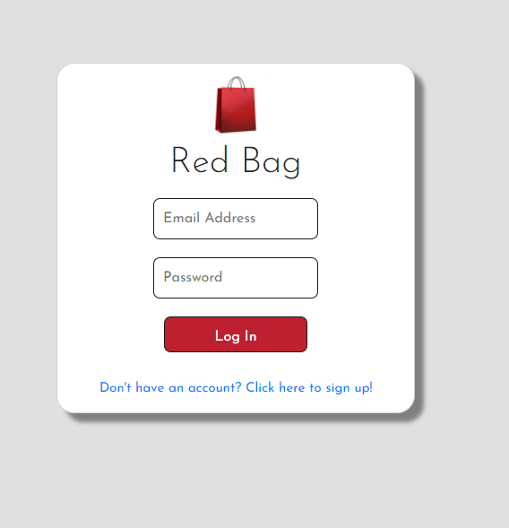

# Interactive Full-Stack Project - Red Bag

Red Bag is a fully functional E commerce website that allows users to post things around thier house to sell.

The application gives yout the following options:
* Use Node.js and Express.js to create a RESTful API.
* Use Handlebars.js as the templating engine.
* Have both GET and POST routes for retrieving and adding new data.
* Be deployed using Heroku (with data).
* Use at least one new library, package, or technology that we haven’t discussed.
* Have a polished UI.
* Is responsive for moblie platforms.
* Be interactive (i.e., accept and respond to user input).
* Includes authentication (express-session and cookies).
* Protect API keys and sensitive information with environment variables.

## Installation
---
1. Open Terminal
2. `npm install` for Dependencies
3. Create file call .env and use these variables with your personal mysql crediticals, database name, and Node Enviorment.
    * DB_NAME=''
    * DB_USER=''
    * DB_PW=''
    * DB_SECRET=''
    * GCS_BUCKET=''
    * GCLOUD_PROJECT= ''
    * GCLOUD_CLIENT_EMAIL= ''
    * GCLOUD_PRIVATE_KEY= ''
4. In Terminal
   (Seed your Database) `node seeds/index.js `
5. Type `node server.js` to start your sever.

## Usage
---
1. Run `node server.js` in Terminal to start the server
2. Create and Account using your email.
3. There are muiltiple modules to use.

    

5. Add a product, and ENJOY!

    

## Tool & Resources
---
* [Node.js](https://nodejs.org/en/) - JavaScript runtime environment
* [MySQLWorkbench](https://www.mysql.com/products/workbench/) - Visual database design tool
    ### Dependencies
    ---
    * [Express](https://www.npmjs.com/package/express) - For routing.
    * [Sass/Scss](https://sass-lang.com/) Styling and Responsiveness.
    * [Nodemon](https://www.npmjs.com/package/nodemon)
    * [Handlebars](https://handlebarsjs.com/) Formatting.
    * [Multer](https://www.npmjs.com/package/multer)Multer is a node.js middleware for handling multipart/form-data, which is primarily used for uploading files. It is written on top of busboy for maximum efficiency.
    * [GoogleCloudStorage] (https://www.npmjs.com/package/@google-cloud/storage) Image Storage
    * [Sequelize](https://www.npmjs.com/package/sequelize) - Sequelize is a promise-based Node.js ORM for Postgres, MySQL, MariaDB, SQLite and Microsoft SQL Server
    * [dotenv](https://www.npmjs.com/package/dotenv) - Dotenv is a zero-dependency module that loads environment variables from a .env file into process.env
    * [mysql2](https://www.npmjs.com/package/mysql2) - Used to connect to the MySQL database and perform queries

* [RepoLink] https://github.com/e-leal/project-2
* [HerokuLink]https://red-bag-p2.herokuapp.com/